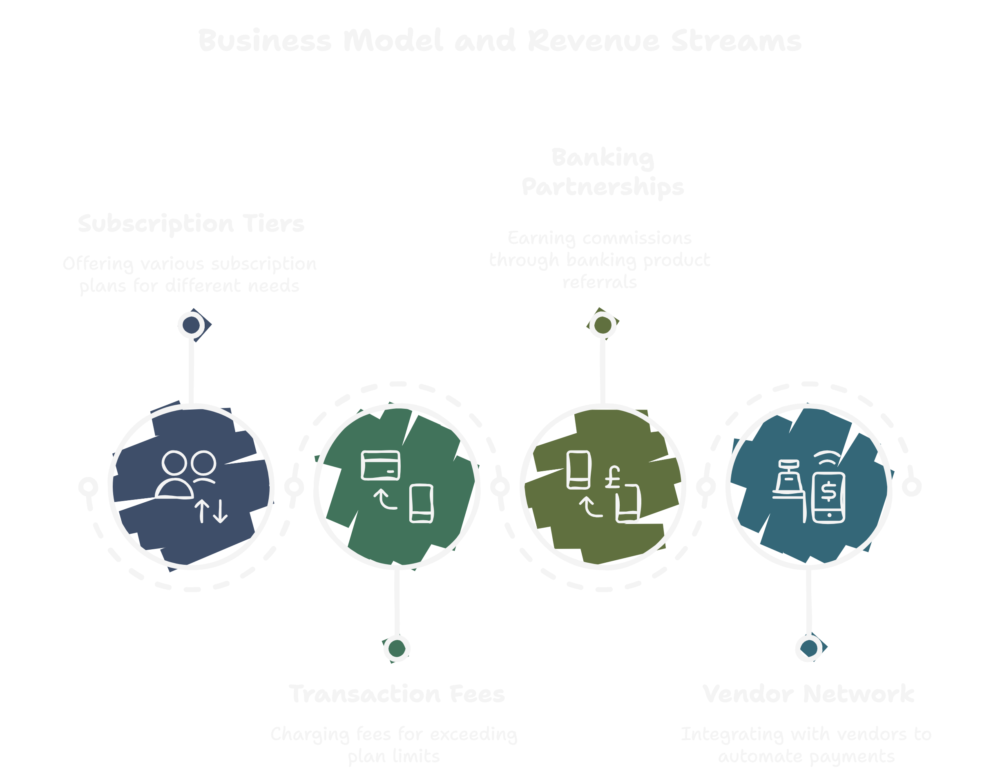

# Agentic Payment Assistant: The AI Accounts Payable Clerk 🤖💸

> **"Turning hours of manual data entry into minutes of automated review."**

---

## 1. The Problem: Why Paying Bills is Hard for Small Businesses 🛑

Small business owners and finance teams suffer from a massive "Messy Data" problem. They do not have enterprise ERP software like SAP or Oracle. Instead, they deal with:

* **Messy Inputs:** Handwritten notebook ledgers, WhatsApp screenshots of bills, and unstructured PDF invoices.
* **Manual Labor:** To pay these vendors, someone has to physically sit at a computer, log into a bank portal, and type every single Account Number, IFSC Code, and Amount by hand.
* **High Risk:** A single typing error means money is sent to the wrong person, leading to financial loss and stress.

This manual process takes 2-3 hours every day for a growing business. Existing OCR tools fail because they expect perfect, digital PDFs—not the real-world mess of small business finance.

---

## 2. The Solution: "God Mode" Automation ✅

We built an **Autonomous AI Agent** that acts like a human employee. It doesn't just "read" data; it actively "does" the work.

**How it works:**

1.  **Universal Ingestion:** The user uploads **anything**—a photo of a handwritten note, a screenshot of a chat, or a formal PDF statement.
2.  **The "Brain" (Gemini 1.5 Flash):** Our AI analyzes the file using multimodal vision. It understands context (e.g., "Pay Bob 5k" means `Vendor: Bob, Amount: 5000`). It extracts structured data from unstructured chaos.
3.  **The "Hands" (Browser Agent):** This is the core innovation. Instead of just giving you a CSV, our agent **spins up a secure, headless web browser**. It navigates to the corporate banking portal, logs in, and fills out the transfer forms exactly like a human would.
4.  **"God Mode" Verification:** The user watches a **Live Video Feed** of the AI working in real-time. They see the agent typing and clicking.
5.  **Human-in-the-Loop Security:** The agent **PAUSES** right before the final transfer and asks the user for a **PIN**. This ensures no money leaves the account without explicit human authorization.

**Result:** A 3-hour boring data entry job is converted into a 2-minute supervision task.

---

## 3. Technical Architecture 🛠️

The system is built on a modern, event-driven microservices architecture designed for security and scalability.

### **Core Stack**
* **Frontend:** React (Vite) + Tailwind CSS (Single Pane of Glass UI).
* **Backend:** Python FastAPI (Async Orchestrator).
* **AI Model:** Google Gemini 1.5 Flash (Multimodal Vision & Reasoning).
* **Browser Automation:** Playwright (Headless Chromium) with Custom Action Engine.
* **Database:** PostgreSQL (Transactional Persistence).
* **Queue System:** Redis + Celery (Task Management).
* **Notifications:** Twilio API (WhatsApp Integration for Remote Approvals).
* **Infrastructure:** Docker Compose + Ngrok (Secure Tunneling).

### **Key Innovations**
* **Unified Proxy Interface:** The user never leaves the dashboard (`localhost:3000`). The backend proxies the Mock Bank interface seamlessly, creating a "Single Portal" experience.
* **Live Stream Protocol:** The worker container streams frame-by-frame screenshots to the frontend via a shared volume, enabling the "God Mode" view with sub-second latency.
* **Robust "Messy Data" Pipeline:** A custom prompt engineering layer allows the system to parse handwritten notes and mixed-format documents that break standard OCR tools.

---

## 4. Business Model & Future Scale 💼

Our monetization strategy focuses on accessibility for small businesses while scaling with their growth.

### **1. Subscription Tiers (Recurring Revenue)**
* **Free Tier:** Up to 10 invoices/month. Ideal for freelancers to experience the "magic."
* **Pro Plan ($29/month):** Up to 500 invoices, WhatsApp integration, and Priority Processing.
* **Enterprise:** Custom volume, API access, and Dedicated Support for large finance teams.

### **2. Usage-Based Fees**
* For bulk users exceeding their plan limits, we charge a small transaction fee (e.g., $0.10) per additional processed invoice, ensuring our revenue aligns with customer value.

### **3. Strategic Expansion**
* **Banking Partnerships:** We plan to white-label this technology for Neo-Banks, earning referral commissions on financial products (credit lines, working capital) recommended based on the cash flow data we process.
* **Vendor Network:** Future updates will allow direct "Request to Pay" links sent to vendors, automating the entire cycle and removing the need for invoice uploads entirely.

---

**Built with ❤️ for Hackathon 2025**